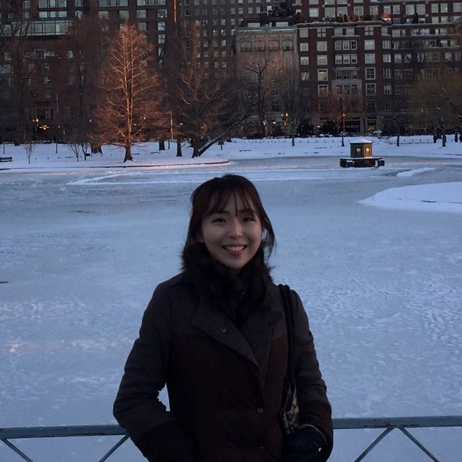

Welcome! My name is Sae (pronounced "say") and I am a PhD candidate in Organizational Behavior & Theory at Carnegie Mellon University's Tepper School of Business. I am on the 2022-2023 academic job market.

My research examines strategic human capital through the lens of knowledge management, with an emphasis on understanding how the interplay of incentives and social relationships shapes knowledge and learning processes that underlie outcomes at both the individual and the organizational levels. My work considers how individual-level human capital characteristics influence the drivers of performance by the collective human capital pool, focusing on the antecedents and consequences of intraorganizational knowledge transfer and human capital development.

Empirically, I integrate digital trace data (i.e., records of activity on digital systems) with large-scale datasets and fieldwork by applying machine learning, transaction log analysis, social network analysis, and econometric methods.

My research has been recognized with accolades such as the [Carnegie Mellon University Presidential Fellowship](https://www.cmu.edu/tepper/news/stories/2021/april/phd-fellowships-awarded.html) and the Gerald R. Salancik Doctoral Dissertation Fellowship Award.

Prior to starting my PhD, I studied business and economics at Seoul National University and dabbled in edutech entrepreneurship. In my free time, I enjoy boxing, mountaineering, attending concerts, cheering for the Pittsburgh Penguins, and playing with my cat [Waffles](WafflesPark.jpg).

Connect with me on [Twitter](https://www.twitter.com/sae_park_) and [Google Scholar](https://scholar.google.com/citations?user=2gHkfJcAAAAJ&hl=en)!

[Home](./index.html) | [Research](./research.html) | [Teaching](./teaching.html) | [CV](./CV.html)  
