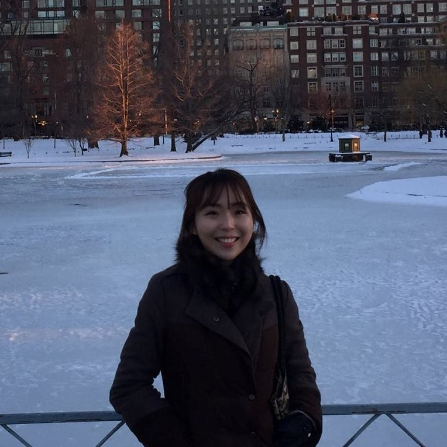

  
  

    <h1>Sae-Seul Park</h1>
    

      <strong>Assistant Professor of Strategic Management</strong> 
      <a href="https://www.rotman.utoronto.ca/">Rotman School of Management</a> 
      <a href="https://www.utoronto.ca/">University of Toronto</a>
    

    

      <a href="mailto:saeseul.park@rotman.utoronto.ca">saeseul [dot] park [at] rotman [dot] utoronto [dot] ca</a> 
      <!-- <a href="https://apps.rotman.utoronto.ca/rDrive/?CVmottkevi">CV (PDF)</a>  -->
      <a href="https://discover.research.utoronto.ca/52890-saeseul-park">Faculty Profile</a> 
      <a href="https://www.linkedin.com/in/sae-park/">LinkedIn</a>
    

  

## About

I am an Assistant Professor of Strategic Management at the Rotman School of Management. I research strategic human capital and knowledge transfer through two interconnected streams. In one stream, I investigate how the interplay of incentives and individual differences in human capital shape organizational knowledge flows by influencing behaviors related to knowledge sharing, knowledge sourcing, and digital information systems use. In the second stream, I examine how the development and deployment of human capital affect organizational performance, investigating the influence of factors such as training and professionalization on frontline decision making that ultimately affects organizational performance. Across these projects, I leverage fine-grained digital trace data to construct unobstrusive behavioral measures that capture individual-level efforts and processes not visible through traditional outcome-based measures.

I received my Ph.D. from Carnegie Mellon University, and my MA and BBA from Seoul National University. To non-Korean speakers, I go by Sae (pronounced "say").

[Home](./index.html) | [Research](./research.html) | [Teaching](./teaching.html) | [CV](./CV.html)  
